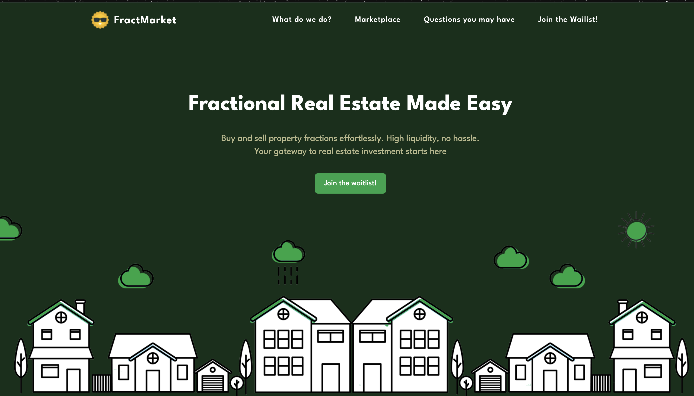

# FractkMarket
FractkMarket is a modern web application that makes fractional real estate investment accessible and easy. This repository contains the landing page implementation built with React and Tailwind CSS.

## Connect With Us
- 🌐 Website: [fractmarket.com](https://fractmarket.com)
- 🐦 Twitter: [@FractMarket](https://x.com/fractmarket)
- 💻 GitHub: [@0xFractMarket](https://github.com/0xFractMarket)
- 🏗️ OnlyDust: [FractMarket Project](https://app.onlydust.com/projects/fractmarket)
- 💬 Telegram for devs [FractMarket Devs](https://t.me/+phFVWzH5xp05OWFh)

## Contributing
We welcome contributions to FractkMarket! To get started:

1. Visit our [OnlyDust Project](https://app.onlydust.com/projects/fractmarket) to see available issues and tasks
2. Join our [Telegram Dev Channel](https://t.me/+phFVWzH5xp05OWFh) to connect with the team
3. Fork the repository and create a new branch for your feature
4. Make your changes following our coding standards
5. Submit a pull request with a clear description of your changes
6. Wait for review and feedback from the team

### Development Guidelines
- Follow the existing code style and structure
- Write clear commit messages
- Add tests for new features
- Update documentation as needed
- Ensure all tests pass before submitting PRs

## Installation

### Pre requisites
- Node.js (Latest LTS version recommended)
- npm or yarn package manager

1. Clone the repository:
```bash
git clone [repository-url]
cd website/Landing
```

2. Install dependencies:
```bash
npm install
# or
yarn install
```

3. Start the development server:
```bash
npm start
# or
yarn start
```

The application will be available at `http://localhost:3000`

### Project Structure
```
